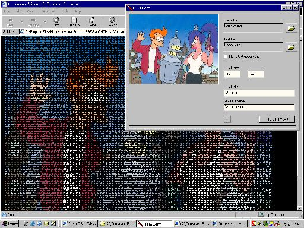



## HTML Art

### Description

Give it a picture file and a text file and be amazed at the output. The resulting html page will fascinate your friends for many a minute. /*Update: Stall bug should be fixed now*/
 
### More Info
 

             |
---                |---
**Submitted On**   |2003-09-08 09:51:56
**By**             |[Paul Bahlawan](https://github.com/Planet-Source-Code/PSCIndex/blob/master/ByAuthor/paul-bahlawan.md)
**Level**          |Intermediate
**User Rating**    |4.9 (88 globes from 18 users)
**Compatibility**  |VB 6\.0
**Category**       |[Internet/ HTML](https://github.com/Planet-Source-Code/PSCIndex/blob/master/ByCategory/internet-html__1-34.md)
**World**          |[Visual Basic](https://github.com/Planet-Source-Code/PSCIndex/blob/master/ByWorld/visual-basic.md)
**Archive File**   |[HTML\_Art164293982003\.zip](https://github.com/Planet-Source-Code/paul-bahlawan-html-art__1-48156/archive/master.zip)

